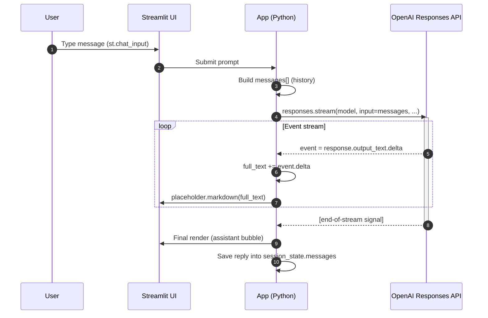

# 🤖 Streamlit Chat with OpenAI API

A minimal **chat interface** built with [Streamlit](https://streamlit.io/) and the [OpenAI Python SDK](https://github.com/openai/openai-python).  
It uses the **Responses API** with **streaming** support and includes a **🧹 Clean chat** button to reset the conversation.

---

## ✨ Features
- Simple chat UI powered by Streamlit’s `st.chat_message`.
- Sidebar controls:
  - Select the model (default: `gpt-5-nano`)
  - Adjust verbosity and reasoning effort.
  - **Clean chat** button to reset history.
- Conversation history persisted in `st.session_state`.
- **Streaming responses** (assistant reply updates token by token).
- Works with `OPENAI_API_KEY` stored in:
  - `.streamlit/secrets.toml`  
  - or as an environment variable.

---

## 📦 Installation

Clone this repo and install dependencies:

```bash
git clone https://github.com/MottaDavide/streamlit-openai-chat.git
cd streamlit-openai-chat
```

### 𖠉 Installation with pip

```
# Create virtual environment (optional)
python -m venv .venv
source .venv/bin/activate   # on Linux/Mac
.venv\Scripts\activate      # on Windows

# Install dependencies
pip install -r requirements.txt
```

### 🐍 Installation with Conda

```bash
# Create the environment from the YAML file
conda env create -f environment.yaml

# Activate it
conda activate streamlit-openai-chat
```

## 📉 Diagram
